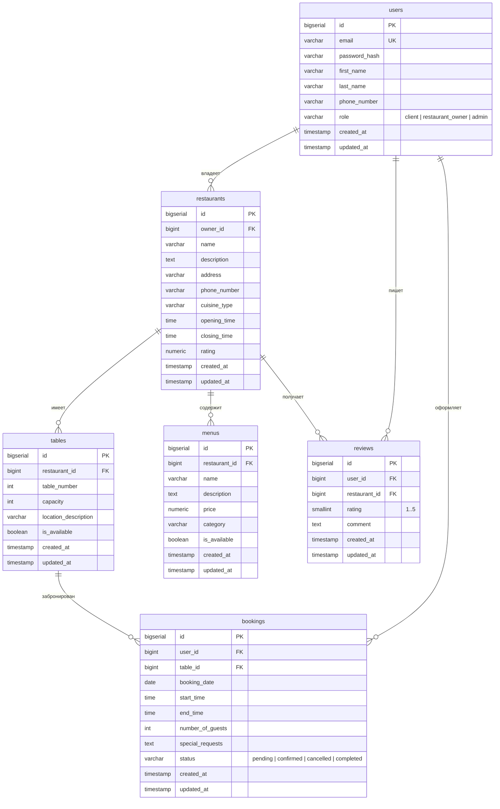

# ДЗ1: Проектирование базы данных

## Вариант проекта: Приложение для бронирования столиков в ресторанах

## ERD диаграмма базы данных

```mermaid
erDiagram
    users {
        bigserial id PK
        varchar email UK
        varchar password_hash
        varchar first_name
        varchar last_name
        varchar phone_number
        varchar role "client | restaurant_owner | admin"
        timestamp created_at
        timestamp updated_at
    }

    restaurants {
        bigserial id PK
        bigint owner_id FK
        varchar name
        text description
        varchar address
        varchar phone_number
        varchar cuisine_type
        time opening_time
        time closing_time
        numeric rating
        timestamp created_at
        timestamp updated_at
    }

    tables {
        bigserial id PK
        bigint restaurant_id FK
        int table_number
        int capacity
        varchar location_description
        boolean is_available
        timestamp created_at
        timestamp updated_at
    }

    bookings {
        bigserial id PK
        bigint user_id FK
        bigint table_id FK
        date booking_date
        time start_time
        time end_time
        int number_of_guests
        text special_requests
        varchar status "pending | confirmed | cancelled | completed"
        timestamp created_at
        timestamp updated_at
    }

    menus {
        bigserial id PK
        bigint restaurant_id FK
        varchar name
        text description
        numeric price
        varchar category
        boolean is_available
        timestamp created_at
        timestamp updated_at
    }

    reviews {
        bigserial id PK
        bigint user_id FK
        bigint restaurant_id FK
        smallint rating "1..5"
        text comment
        timestamp created_at
        timestamp updated_at
    }

    users ||--o{ bookings : "оформляет"
    tables ||--o{ bookings : "забронирован"
    restaurants ||--o{ tables : "имеет"
    restaurants ||--o{ menus : "содержит"
    users ||--o{ reviews : "пишет"
    restaurants ||--o{ reviews : "получает"
    users ||--o{ restaurants : "владеет"
```