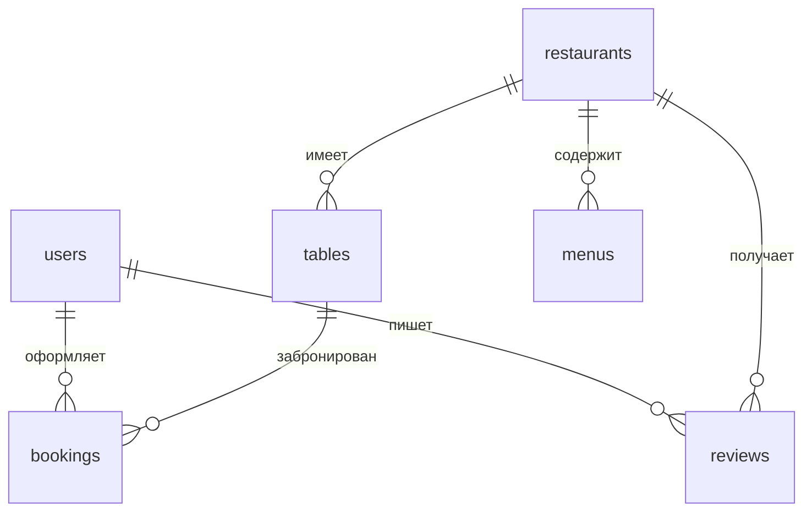

# ДЗ1: Проектирование базы данных

## Вариант проекта: Приложение для бронирования столиков в ресторанах

## ERD диаграмма базы данных

### Таблица: Пользователи (users)
- id (PK)
- email (unique)
- password_hash
- first_name
- last_name
- phone_number
- role (client, restaurant_owner, admin)
- created_at
- updated_at

### Таблица: Рестораны (restaurants)
- id (PK)
- owner_id (FK to users.id)
- name
- description
- address
- phone_number
- cuisine_type
- opening_time
- closing_time
- rating
- created_at
- updated_at

### Таблица: Столики (tables)
- id (PK)
- restaurant_id (FK to restaurants.id)
- table_number
- capacity
- location_description
- is_available
- created_at
- updated_at

### Таблица: Бронирования (bookings)
- id (PK)
- user_id (FK to users.id)
- table_id (FK to tables.id)
- booking_date
- start_time
- end_time
- number_of_guests
- special_requests
- status (pending, confirmed, cancelled, completed)
- created_at
- updated_at

### Таблица: Меню (menus)
- id (PK)
- restaurant_id (FK to restaurants.id)
- name
- description
- price
- category
- is_available
- created_at
- updated_at

### Таблица: Отзывы (reviews)
- id (PK)
- user_id (FK to users.id)
- restaurant_id (FK to restaurants.id)
- rating (1-5)
- comment
- created_at
- updated_at