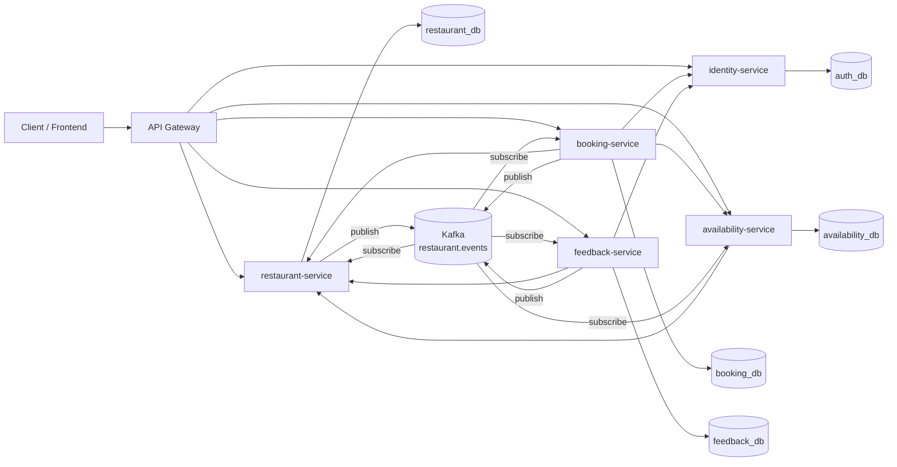

# ДЗ4. Технический дизайн микросервисной архитектуры

## 1. Цель документа

Цель работы — спроектировать переход существующего монолитного backend-приложения для бронирования столиков в ресторанах к микросервисной архитектуре с соблюдением принципа **database-per-service**.

Документ описывает:

- декомпозицию монолита на отдельные микросервисы;
- зоны ответственности каждого сервиса;
- взаимодействие сервисов между собой;
- разделение единой базы данных на независимые базы данных;
- OpenAPI-спецификацию внутренних endpoint'ов для межсервисного взаимодействия;
- форматы запросов, ответов и ошибок;
- пошаговый план миграции монолита на микросервисы.

Исходная система — ресторанное приложение с пользователями, ресторанами, столиками, меню, бронированиями и отзывами.

---

## 2. Текущее состояние монолитного приложения

Сейчас приложение реализовано как единый backend-сервис. Все route-модули подключаются в одном приложении и работают с одной общей базой данных.

Основные функциональные модули монолита:

| Модуль | Назначение |
| --- | --- |
| Auth | Авторизация пользователя и выдача JWT-токена |
| Users | Регистрация, просмотр и изменение пользователей |
| Restaurants | Управление ресторанами |
| Tables | Управление столиками ресторана |
| Menu | Управление позициями меню |
| Bookings | Создание и управление бронированиями |
| Reviews | Создание и просмотр отзывов |

Текущая единая база данных содержит таблицы:

| Таблица | Назначение |
| --- | --- |
| users | Пользователи, роли, email, пароль |
| restaurants | Рестораны и информация о владельце |
| tables | Столики ресторанов |
| bookings | Бронирования столиков пользователями |
| menu_items | Позиции меню ресторанов |
| reviews | Отзывы пользователей о ресторанах |

Проблемы текущего монолита:

1. Все модули зависят от одной базы данных.
2. Между таблицами используются прямые внешние ключи.
3. Нельзя независимо масштабировать бронирования, каталог ресторанов и отзывы.
4. Ошибка в одном модуле может повлиять на весь backend.
5. Сложно независимо развивать команды и релизы отдельных частей системы.

---

## 3. Целевая микросервисная архитектура

Предлагается выделить 5 микросервисов и API Gateway.



### 3.1. API Gateway

API Gateway является единой точкой входа для клиентского приложения.

Ответственность API Gateway:

- маршрутизация внешних HTTP-запросов к нужному микросервису;
- проверка JWT-токена на публичном уровне;
- передача `X-User-Id` и `X-User-Role` во внутренние сервисы;
- агрегация данных для сложных клиентских экранов;
- rate limiting и логирование запросов.

API Gateway не хранит бизнес-данные и не имеет собственной бизнес-БД.

---

## 4. Декомпозиция на микросервисы

### 4.1. identity-service

Назначение: управление пользователями, регистрацией, авторизацией и ролями.

Владеет данными:

- пользователи;
- хеши паролей;
- роли пользователей;
- данные профиля.

Основные внешние операции:

- регистрация пользователя;
- вход в систему;
- получение текущего пользователя;
- изменение профиля.

Внутренние операции для других сервисов:

- проверка существования пользователя;
- получение краткой информации о пользователе;
- проверка роли пользователя.

---

### 4.2. restaurant-service

Назначение: управление ресторанным каталогом.

Владеет данными:

- рестораны;
- меню ресторанов;
- агрегированный рейтинг ресторана;
- связь ресторана с владельцем по `ownerId`.

Важно: `ownerId` хранится как внешний идентификатор из `identity-service`, но без внешнего ключа в базе данных.

Основные внешние операции:

- список ресторанов;
- карточка ресторана;
- создание ресторана владельцем;
- изменение ресторана;
- управление меню.

Внутренние операции:

- проверка существования ресторана;
- проверка владельца ресторана;
- получение кратких данных ресторана;
- обновление агрегированного рейтинга после событий из `feedback-service`.

---

### 4.3. availability-service

Назначение: управление столиками и доступностью временных слотов.

Владеет данными:

- столики;
- вместимость столиков;
- расположение столиков;
- технические блокировки слотов;
- состояние доступности.

Основные внешние операции:

- просмотр столиков ресторана;
- создание, изменение и удаление столиков владельцем;
- просмотр доступности на дату.

Внутренние операции:

- проверка существования столика;
- проверка вместимости столика;
- проверка доступности слота;
- резервирование слота на время создания бронирования;
- освобождение слота при отмене бронирования.

---

### 4.4. booking-service

Назначение: управление жизненным циклом бронирования.

Владеет данными:

- бронирования;
- статус бронирования;
- дата и время бронирования;
- количество гостей;
- специальные пожелания клиента.

Сервис не хранит полные данные пользователя, ресторана или столика. Он хранит только внешние идентификаторы:

- `userId` из `identity-service`;
- `restaurantId` из `restaurant-service`;
- `tableId` из `availability-service`.

Основные внешние операции:

- создать бронирование;
- получить список бронирований пользователя;
- получить бронирование по ID;
- изменить бронирование;
- отменить бронирование.

Внутренние зависимости:

- `identity-service` — проверить пользователя;
- `restaurant-service` — проверить ресторан;
- `availability-service` — проверить столик и доступность.

---

### 4.5. feedback-service

Назначение: управление отзывами и оценками.

Владеет данными:

- отзывы;
- оценки пользователей;
- комментарии;
- связь `userId + restaurantId` для ограничения "один отзыв на ресторан от одного пользователя".

Сервис не хранит полные данные пользователя и ресторана. Он хранит только внешние идентификаторы.

Основные внешние операции:

- создать отзыв;
- получить отзывы ресторана;
- изменить отзыв;
- удалить отзыв.

Внутренние зависимости:

- `identity-service` — получить имя пользователя для отображения;
- `restaurant-service` — проверить существование ресторана.

После создания, изменения или удаления отзыва сервис публикует событие для обновления рейтинга ресторана.

---

## 5. Взаимодействие между микросервисами

### 5.1. Синхронное взаимодействие

Синхронное взаимодействие выполняется через HTTP/REST.

Используется для операций, где ответ нужен немедленно:

| Сценарий | Кто вызывает | Кого вызывает | Endpoint |
| --- | --- | --- | --- |
| Создание бронирования | booking-service | identity-service | `GET /internal/users/{userId}` |
| Создание бронирования | booking-service | restaurant-service | `GET /internal/restaurants/{restaurantId}` |
| Создание бронирования | booking-service | availability-service | `POST /internal/availability/check` |
| Создание бронирования | booking-service | availability-service | `POST /internal/availability/reserve` |
| Создание отзыва | feedback-service | restaurant-service | `GET /internal/restaurants/{restaurantId}` |
| Получение отзывов | feedback-service | identity-service | `POST /internal/users/batch` |
| Управление столиком | availability-service | restaurant-service | `GET /internal/restaurants/{restaurantId}/ownership` |

### 5.2. Асинхронное взаимодействие

Асинхронное взаимодействие выполняется через брокер сообщений **Kafka** (топик `restaurant.events`). Каждый сервис-подписчик использует отдельную consumer group (имя сервиса), поэтому все получатели видят одни и те же события.

События:

| Событие | Отправитель | Получатель | Назначение |
| --- | --- | --- | --- |
| `booking.created` | booking-service | availability-service | Зафиксировать занятый слот |
| `booking.cancelled` | booking-service | availability-service | Освободить слот |
| `review.created` | feedback-service | restaurant-service | Пересчитать рейтинг ресторана |
| `review.updated` | feedback-service | restaurant-service | Пересчитать рейтинг ресторана |
| `review.deleted` | feedback-service | restaurant-service | Пересчитать рейтинг ресторана |
| `restaurant.deleted` | restaurant-service | availability-service, booking-service, feedback-service | Запретить новые операции по ресторану |

Асинхронный подход нужен для операций, где не требуется моментальный ответ клиенту или возможна eventual consistency.

---

## 6. Разделение базы данных

Главное правило: каждый микросервис владеет только своей базой данных. Другие сервисы не имеют прямого доступа к чужим таблицам.

### 6.1. auth_db

Владелец: `identity-service`.

Таблица `users`:

| Поле | Тип | Описание |
| --- | --- | --- |
| id | integer | Идентификатор пользователя |
| email | varchar | Email, уникальный |
| first_name | varchar | Имя |
| last_name | varchar | Фамилия |
| phone_number | varchar nullable | Телефон |
| role | varchar | Роль: client, owner, admin |
| password_hash | varchar | Хеш пароля |
| created_at | timestamp | Дата создания |
| updated_at | timestamp | Дата обновления |

Индексы:

- unique index по `email`;
- index по `role`.

---

### 6.2. restaurant_db

Владелец: `restaurant-service`.

Таблица `restaurants`:

| Поле | Тип | Описание |
| --- | --- | --- |
| id | integer | Идентификатор ресторана |
| name | varchar | Название |
| description | text nullable | Описание |
| address | varchar | Адрес |
| phone_number | varchar nullable | Телефон |
| cuisine_type | varchar nullable | Тип кухни |
| opening_time | varchar nullable | Время открытия |
| closing_time | varchar nullable | Время закрытия |
| rating | decimal | Агрегированный рейтинг |
| image_url | varchar nullable | Изображение |
| owner_id | integer | ID владельца из identity-service |
| created_at | timestamp | Дата создания |
| updated_at | timestamp | Дата обновления |

Таблица `menu_items`:

| Поле | Тип | Описание |
| --- | --- | --- |
| id | integer | Идентификатор позиции меню |
| restaurant_id | integer | ID ресторана внутри restaurant_db |
| name | varchar | Название |
| description | text nullable | Описание |
| price | decimal | Цена |
| category | varchar nullable | Категория |
| is_available | boolean | Доступность позиции |
| created_at | timestamp | Дата создания |
| updated_at | timestamp | Дата обновления |

Индексы:

- index по `restaurants.owner_id`;
- index по `restaurants.cuisine_type`;
- index по `restaurants.rating`;
- index по `menu_items.restaurant_id`;
- composite index по `menu_items.restaurant_id + is_available`.

---

### 6.3. availability_db

Владелец: `availability-service`.

Таблица `tables`:

| Поле | Тип | Описание |
| --- | --- | --- |
| id | integer | Идентификатор столика |
| restaurant_id | integer | ID ресторана из restaurant-service |
| table_number | integer | Номер столика |
| capacity | integer | Вместимость |
| location_description | text nullable | Расположение |
| is_available | boolean | Доступен ли столик в целом |
| created_at | timestamp | Дата создания |
| updated_at | timestamp | Дата обновления |

Таблица `table_reservations`:

| Поле | Тип | Описание |
| --- | --- | --- |
| id | integer | Идентификатор резерва слота |
| table_id | integer | ID столика внутри availability_db |
| booking_id | integer | ID бронирования из booking-service |
| booking_date | date | Дата |
| start_time | time | Время начала |
| end_time | time | Время окончания |
| status | varchar | reserved, released |
| created_at | timestamp | Дата создания |

Индексы:

- index по `tables.restaurant_id`;
- unique index по `restaurant_id + table_number`;
- composite index по `table_id + booking_date + status`.

---

### 6.4. booking_db

Владелец: `booking-service`.

Таблица `bookings`:

| Поле | Тип | Описание |
| --- | --- | --- |
| id | integer | Идентификатор бронирования |
| user_id | integer | ID пользователя из identity-service |
| restaurant_id | integer | ID ресторана из restaurant-service |
| table_id | integer | ID столика из availability-service |
| booking_date | date | Дата бронирования |
| start_time | time | Время начала |
| end_time | time | Время окончания |
| number_of_guests | integer | Количество гостей |
| special_requests | text nullable | Пожелания |
| status | varchar | pending, confirmed, cancelled, completed |
| created_at | timestamp | Дата создания |
| updated_at | timestamp | Дата обновления |

Индексы:

- index по `user_id`;
- index по `restaurant_id`;
- index по `table_id`;
- composite index по `table_id + booking_date + status`.

---

### 6.5. feedback_db

Владелец: `feedback-service`.

Таблица `reviews`:

| Поле | Тип | Описание |
| --- | --- | --- |
| id | integer | Идентификатор отзыва |
| user_id | integer | ID пользователя из identity-service |
| restaurant_id | integer | ID ресторана из restaurant-service |
| rating | integer | Оценка от 1 до 5 |
| comment | text nullable | Комментарий |
| created_at | timestamp | Дата создания |
| updated_at | timestamp | Дата обновления |

Индексы:

- index по `restaurant_id`;
- unique index по `user_id + restaurant_id`.

---

## 7. Принципы работы без внешних ключей между сервисами

В монолите таблицы используют внешние ключи между `users`, `restaurants`, `tables`, `bookings` и `reviews`.

В микросервисной архитектуре внешние ключи между разными БД запрещены. Вместо этого используются следующие правила:

1. Каждый сервис хранит внешние идентификаторы как обычные поля.
2. Перед созданием записи сервис проверяет внешнюю сущность через внутренний API другого сервиса.
3. Для критичных операций используется идемпотентность.
4. Для асинхронных изменений используется eventual consistency.
5. Для удаления сущностей используется soft delete или статус `archived/deleted`, чтобы не ломать исторические данные.

Пример: `booking-service` не имеет FK на пользователя. Перед созданием бронирования он вызывает `identity-service` и проверяет, что пользователь существует и активен.

---

## 8. OpenAPI-спецификация межсервисных endpoint'ов

Ниже приведена спецификация внутренних API, необходимых для взаимодействия микросервисов.

```yaml
openapi: 3.0.3
info:
  title: Restaurant Booking Internal Microservices API
  version: 1.0.0
  description: Internal REST API for communication between restaurant booking microservices.

servers:
  - url: http://identity-service:8080
    description: identity-service
  - url: http://restaurant-service:8080
    description: restaurant-service
  - url: http://availability-service:8080
    description: availability-service
  - url: http://booking-service:8080
    description: booking-service
  - url: http://feedback-service:8080
    description: feedback-service

security:
  - serviceTokenAuth: []

paths:
  /internal/users/{userId}:
    get:
      tags: [Identity]
      summary: Get short user information by ID
      description: Used by booking-service and feedback-service to validate users and enrich responses.
      parameters:
        - name: userId
          in: path
          required: true
          schema:
            type: integer
      responses:
        '200':
          description: User exists
          content:
            application/json:
              schema:
                $ref: '#/components/schemas/InternalUserResponse'
        '401':
          $ref: '#/components/responses/Unauthorized'
        '403':
          $ref: '#/components/responses/Forbidden'
        '404':
          $ref: '#/components/responses/UserNotFound'
        '503':
          $ref: '#/components/responses/ServiceUnavailable'

  /internal/users/batch:
    post:
      tags: [Identity]
      summary: Get multiple users by IDs
      description: Used by feedback-service to show user names near reviews.
      requestBody:
        required: true
        content:
          application/json:
            schema:
              type: object
              required: [userIds]
              properties:
                userIds:
                  type: array
                  items:
                    type: integer
                  example: [1, 2, 3]
      responses:
        '200':
          description: Users found
          content:
            application/json:
              schema:
                type: object
                properties:
                  users:
                    type: array
                    items:
                      $ref: '#/components/schemas/InternalUserResponse'
        '400':
          $ref: '#/components/responses/BadRequest'
        '401':
          $ref: '#/components/responses/Unauthorized'
        '403':
          $ref: '#/components/responses/Forbidden'
        '503':
          $ref: '#/components/responses/ServiceUnavailable'

  /internal/restaurants/{restaurantId}:
    get:
      tags: [Restaurant]
      summary: Get short restaurant information by ID
      description: Used by booking-service, feedback-service and availability-service.
      parameters:
        - name: restaurantId
          in: path
          required: true
          schema:
            type: integer
      responses:
        '200':
          description: Restaurant exists
          content:
            application/json:
              schema:
                $ref: '#/components/schemas/InternalRestaurantResponse'
        '401':
          $ref: '#/components/responses/Unauthorized'
        '403':
          $ref: '#/components/responses/Forbidden'
        '404':
          $ref: '#/components/responses/RestaurantNotFound'
        '503':
          $ref: '#/components/responses/ServiceUnavailable'

  /internal/restaurants/{restaurantId}/ownership:
    get:
      tags: [Restaurant]
      summary: Check restaurant ownership
      description: Used by availability-service before creating or changing restaurant tables.
      parameters:
        - name: restaurantId
          in: path
          required: true
          schema:
            type: integer
        - name: ownerId
          in: query
          required: true
          schema:
            type: integer
      responses:
        '200':
          description: Ownership check result
          content:
            application/json:
              schema:
                $ref: '#/components/schemas/OwnershipResponse'
        '400':
          $ref: '#/components/responses/BadRequest'
        '401':
          $ref: '#/components/responses/Unauthorized'
        '403':
          $ref: '#/components/responses/Forbidden'
        '404':
          $ref: '#/components/responses/RestaurantNotFound'
        '503':
          $ref: '#/components/responses/ServiceUnavailable'

  /internal/restaurants/{restaurantId}/rating:
    put:
      tags: [Restaurant]
      summary: Update restaurant aggregate rating
      description: Called by feedback-service after review changes.
      parameters:
        - name: restaurantId
          in: path
          required: true
          schema:
            type: integer
      requestBody:
        required: true
        content:
          application/json:
            schema:
              $ref: '#/components/schemas/UpdateRatingRequest'
      responses:
        '200':
          description: Rating updated
          content:
            application/json:
              schema:
                $ref: '#/components/schemas/RatingResponse'
        '400':
          $ref: '#/components/responses/BadRequest'
        '401':
          $ref: '#/components/responses/Unauthorized'
        '403':
          $ref: '#/components/responses/Forbidden'
        '404':
          $ref: '#/components/responses/RestaurantNotFound'
        '422':
          $ref: '#/components/responses/ValidationError'
        '503':
          $ref: '#/components/responses/ServiceUnavailable'

  /internal/tables/{tableId}:
    get:
      tags: [Availability]
      summary: Get table information by ID
      description: Used by booking-service to validate selected table.
      parameters:
        - name: tableId
          in: path
          required: true
          schema:
            type: integer
      responses:
        '200':
          description: Table exists
          content:
            application/json:
              schema:
                $ref: '#/components/schemas/InternalTableResponse'
        '401':
          $ref: '#/components/responses/Unauthorized'
        '403':
          $ref: '#/components/responses/Forbidden'
        '404':
          $ref: '#/components/responses/TableNotFound'
        '503':
          $ref: '#/components/responses/ServiceUnavailable'

  /internal/availability/check:
    post:
      tags: [Availability]
      summary: Check table availability for a time slot
      description: Used by booking-service before creating or updating a booking.
      requestBody:
        required: true
        content:
          application/json:
            schema:
              $ref: '#/components/schemas/AvailabilityCheckRequest'
      responses:
        '200':
          description: Availability check result
          content:
            application/json:
              schema:
                $ref: '#/components/schemas/AvailabilityCheckResponse'
        '400':
          $ref: '#/components/responses/BadRequest'
        '401':
          $ref: '#/components/responses/Unauthorized'
        '403':
          $ref: '#/components/responses/Forbidden'
        '404':
          $ref: '#/components/responses/TableNotFound'
        '409':
          $ref: '#/components/responses/SlotAlreadyBooked'
        '422':
          $ref: '#/components/responses/ValidationError'
        '503':
          $ref: '#/components/responses/ServiceUnavailable'

  /internal/availability/reserve:
    post:
      tags: [Availability]
      summary: Reserve table slot for booking
      description: Used by booking-service after successful validation.
      requestBody:
        required: true
        content:
          application/json:
            schema:
              $ref: '#/components/schemas/ReserveSlotRequest'
      responses:
        '201':
          description: Slot reserved
          content:
            application/json:
              schema:
                $ref: '#/components/schemas/ReserveSlotResponse'
        '400':
          $ref: '#/components/responses/BadRequest'
        '401':
          $ref: '#/components/responses/Unauthorized'
        '403':
          $ref: '#/components/responses/Forbidden'
        '404':
          $ref: '#/components/responses/TableNotFound'
        '409':
          $ref: '#/components/responses/SlotAlreadyBooked'
        '422':
          $ref: '#/components/responses/ValidationError'
        '503':
          $ref: '#/components/responses/ServiceUnavailable'

  /internal/availability/release:
    post:
      tags: [Availability]
      summary: Release previously reserved table slot
      description: Used by booking-service after booking cancellation.
      requestBody:
        required: true
        content:
          application/json:
            schema:
              $ref: '#/components/schemas/ReleaseSlotRequest'
      responses:
        '200':
          description: Slot released
          content:
            application/json:
              schema:
                $ref: '#/components/schemas/ReleaseSlotResponse'
        '400':
          $ref: '#/components/responses/BadRequest'
        '401':
          $ref: '#/components/responses/Unauthorized'
        '403':
          $ref: '#/components/responses/Forbidden'
        '404':
          $ref: '#/components/responses/ReservationNotFound'
        '503':
          $ref: '#/components/responses/ServiceUnavailable'

components:
  securitySchemes:
    serviceTokenAuth:
      type: http
      scheme: bearer
      bearerFormat: service-token

  schemas:
    InternalUserResponse:
      type: object
      required: [id, email, firstName, lastName, role, active]
      properties:
        id:
          type: integer
          example: 10
        email:
          type: string
          format: email
          example: user@example.com
        firstName:
          type: string
          example: Ivan
        lastName:
          type: string
          example: Petrov
        fullName:
          type: string
          example: Ivan Petrov
        role:
          type: string
          enum: [client, owner, admin]
          example: client
        active:
          type: boolean
          example: true

    InternalRestaurantResponse:
      type: object
      required: [id, name, ownerId, active]
      properties:
        id:
          type: integer
          example: 25
        name:
          type: string
          example: White Rabbit
        address:
          type: string
          example: Moscow, Smolenskaya Square, 3
        ownerId:
          type: integer
          example: 7
        rating:
          type: number
          format: float
          example: 4.7
        active:
          type: boolean
          example: true

    OwnershipResponse:
      type: object
      required: [restaurantId, ownerId, isOwner]
      properties:
        restaurantId:
          type: integer
          example: 25
        ownerId:
          type: integer
          example: 7
        isOwner:
          type: boolean
          example: true

    UpdateRatingRequest:
      type: object
      required: [rating, reviewsCount]
      properties:
        rating:
          type: number
          format: float
          minimum: 0
          maximum: 5
          example: 4.6
        reviewsCount:
          type: integer
          minimum: 0
          example: 125
        sourceEventId:
          type: string
          example: review.updated.1001

    RatingResponse:
      type: object
      required: [restaurantId, rating, reviewsCount]
      properties:
        restaurantId:
          type: integer
          example: 25
        rating:
          type: number
          format: float
          example: 4.6
        reviewsCount:
          type: integer
          example: 125

    InternalTableResponse:
      type: object
      required: [id, restaurantId, capacity, isAvailable]
      properties:
        id:
          type: integer
          example: 15
        restaurantId:
          type: integer
          example: 25
        tableNumber:
          type: integer
          example: 4
        capacity:
          type: integer
          example: 4
        locationDescription:
          type: string
          example: Near the window
        isAvailable:
          type: boolean
          example: true

    AvailabilityCheckRequest:
      type: object
      required: [tableId, bookingDate, startTime, endTime, guests]
      properties:
        tableId:
          type: integer
          example: 15
        bookingDate:
          type: string
          format: date
          example: 2026-05-20
        startTime:
          type: string
          example: '19:00'
        endTime:
          type: string
          example: '21:00'
        guests:
          type: integer
          minimum: 1
          example: 4

    AvailabilityCheckResponse:
      type: object
      required: [tableId, available]
      properties:
        tableId:
          type: integer
          example: 15
        available:
          type: boolean
          example: true
        reason:
          type: string
          nullable: true
          example: null

    ReserveSlotRequest:
      type: object
      required: [bookingId, tableId, bookingDate, startTime, endTime]
      properties:
        bookingId:
          type: integer
          example: 900
        tableId:
          type: integer
          example: 15
        bookingDate:
          type: string
          format: date
          example: 2026-05-20
        startTime:
          type: string
          example: '19:00'
        endTime:
          type: string
          example: '21:00'
        idempotencyKey:
          type: string
          example: booking-900-reserve

    ReserveSlotResponse:
      type: object
      required: [reservationId, bookingId, status]
      properties:
        reservationId:
          type: integer
          example: 501
        bookingId:
          type: integer
          example: 900
        status:
          type: string
          enum: [reserved]
          example: reserved

    ReleaseSlotRequest:
      type: object
      required: [bookingId]
      properties:
        bookingId:
          type: integer
          example: 900
        reason:
          type: string
          example: booking_cancelled
        idempotencyKey:
          type: string
          example: booking-900-release

    ReleaseSlotResponse:
      type: object
      required: [bookingId, status]
      properties:
        bookingId:
          type: integer
          example: 900
        status:
          type: string
          enum: [released]
          example: released

    ErrorResponse:
      type: object
      required: [code, message]
      properties:
        code:
          type: string
          example: VALIDATION_ERROR
        message:
          type: string
          example: Request validation failed
        details:
          type: object
          additionalProperties: true

  responses:
    BadRequest:
      description: Bad request
      content:
        application/json:
          schema:
            $ref: '#/components/schemas/ErrorResponse'
          example:
            code: BAD_REQUEST
            message: Invalid request parameters

    Unauthorized:
      description: Missing or invalid service token
      content:
        application/json:
          schema:
            $ref: '#/components/schemas/ErrorResponse'
          example:
            code: UNAUTHORIZED
            message: Service token is missing or invalid

    Forbidden:
      description: Service is not allowed to call this endpoint
      content:
        application/json:
          schema:
            $ref: '#/components/schemas/ErrorResponse'
          example:
            code: FORBIDDEN
            message: Service has no permission for this operation

    UserNotFound:
      description: User not found
      content:
        application/json:
          schema:
            $ref: '#/components/schemas/ErrorResponse'
          example:
            code: USER_NOT_FOUND
            message: User was not found

    RestaurantNotFound:
      description: Restaurant not found
      content:
        application/json:
          schema:
            $ref: '#/components/schemas/ErrorResponse'
          example:
            code: RESTAURANT_NOT_FOUND
            message: Restaurant was not found

    TableNotFound:
      description: Table not found
      content:
        application/json:
          schema:
            $ref: '#/components/schemas/ErrorResponse'
          example:
            code: TABLE_NOT_FOUND
            message: Table was not found

    ReservationNotFound:
      description: Reservation not found
      content:
        application/json:
          schema:
            $ref: '#/components/schemas/ErrorResponse'
          example:
            code: RESERVATION_NOT_FOUND
            message: Reservation was not found

    SlotAlreadyBooked:
      description: Requested time slot is already booked
      content:
        application/json:
          schema:
            $ref: '#/components/schemas/ErrorResponse'
          example:
            code: SLOT_ALREADY_BOOKED
            message: Table is already booked for requested time

    ValidationError:
      description: Validation error
      content:
        application/json:
          schema:
            $ref: '#/components/schemas/ErrorResponse'
          example:
            code: VALIDATION_ERROR
            message: Request validation failed
            details:
              field: rating
              reason: must be between 0 and 5

    ServiceUnavailable:
      description: Dependency is temporarily unavailable
      content:
        application/json:
          schema:
            $ref: '#/components/schemas/ErrorResponse'
          example:
            code: SERVICE_UNAVAILABLE
            message: Dependency service is unavailable

```

---

## 9. Основные сценарии межсервисного взаимодействия

### 9.1. Создание бронирования

1. Клиент отправляет запрос `POST /api/bookings` в API Gateway.
2. API Gateway проверяет JWT и передает запрос в `booking-service`.
3. `booking-service` вызывает `identity-service`: проверяет, что пользователь существует и активен.
4. `booking-service` вызывает `availability-service`: получает данные столика.
5. `booking-service` вызывает `restaurant-service`: проверяет ресторан.
6. `booking-service` вызывает `availability-service`: проверяет доступность слота.
7. `booking-service` создает бронирование со статусом `confirmed` или `pending`.
8. `booking-service` вызывает `availability-service`: резервирует слот.
9. Клиент получает ответ с созданным бронированием.

Если слот уже занят, `availability-service` возвращает ошибку `409 SLOT_ALREADY_BOOKED`.

---

### 9.2. Отмена бронирования

1. Клиент отправляет `DELETE /api/bookings/{id}`.
2. API Gateway направляет запрос в `booking-service`.
3. `booking-service` проверяет, что бронирование принадлежит пользователю или пользователь является администратором.
4. `booking-service` меняет статус на `cancelled`.
5. `booking-service` отправляет событие `booking.cancelled` или вызывает `POST /internal/availability/release`.
6. `availability-service` освобождает слот.

---

### 9.3. Создание отзыва

1. Клиент отправляет `POST /api/reviews`.
2. API Gateway направляет запрос в `feedback-service`.
3. `feedback-service` проверяет пользователя через `identity-service`.
4. `feedback-service` проверяет ресторан через `restaurant-service`.
5. `feedback-service` проверяет unique-ограничение `user_id + restaurant_id`.
6. `feedback-service` создает отзыв.
7. `feedback-service` публикует событие `review.created`.
8. `restaurant-service` пересчитывает и сохраняет агрегированный рейтинг.

Если пользователь уже оставлял отзыв на ресторан, возвращается `409 REVIEW_ALREADY_EXISTS`.

---

### 9.4. Получение детальной карточки ресторана

Вариант 1: агрегация на API Gateway.

1. Клиент запрашивает `GET /api/restaurants/{id}`.
2. API Gateway получает данные ресторана из `restaurant-service`.
3. API Gateway получает меню из `restaurant-service`.
4. API Gateway получает отзывы из `feedback-service`.
5. `feedback-service` для отзывов получает имена пользователей из `identity-service`.
6. API Gateway собирает единый ответ.

Такой подход позволяет не создавать жесткую зависимость `restaurant-service` от `feedback-service`.

---

## 10. Ошибки и правила обработки отказов

### 10.1. Единый формат ошибки

Все сервисы должны возвращать ошибки в одном формате:

```json
{
  "code": "SLOT_ALREADY_BOOKED",
  "message": "Table is already booked for requested time",
  "details": {
    "tableId": 15,
    "bookingDate": "2026-05-20",
    "startTime": "19:00",
    "endTime": "21:00"
  }
}

```

### 10.2. Коды ошибок

| HTTP status | Код | Описание |
| --- | --- | --- |
| 400 | BAD_REQUEST | Некорректный формат запроса |
| 401 | UNAUTHORIZED | Отсутствует или неверный токен |
| 403 | FORBIDDEN | Недостаточно прав |
| 404 | USER_NOT_FOUND | Пользователь не найден |
| 404 | RESTAURANT_NOT_FOUND | Ресторан не найден |
| 404 | TABLE_NOT_FOUND | Столик не найден |
| 409 | SLOT_ALREADY_BOOKED | Столик занят на выбранное время |
| 409 | REVIEW_ALREADY_EXISTS | Пользователь уже оставил отзыв |
| 422 | VALIDATION_ERROR | Данные не прошли бизнес-валидацию |
| 503 | SERVICE_UNAVAILABLE | Зависимый сервис временно недоступен |

### 10.3. Обработка недоступности сервисов

Для устойчивости системы нужны следующие механизмы:

- timeout для всех межсервисных HTTP-запросов;
- retry только для идемпотентных операций;
- circuit breaker для защиты от каскадных отказов;
- idempotency key для резервирования и освобождения слотов;
- fallback-ответы для чтения, если это безопасно;
- централизованные логи и request tracing.

---

## 11. Безопасность межсервисного взаимодействия

Для внешних клиентских запросов используется JWT пользователя.

Для внутренних запросов между сервисами используется service token или mTLS.

Правила:

1. Внешний JWT не должен напрямую использоваться как доверенный внутренний токен.
2. API Gateway после проверки JWT передает во внутренние сервисы заголовки:
   - `X-User-Id`;
   - `X-User-Role`;
   - `X-Request-Id`.
3. Внутренние endpoint'ы `/internal/**` недоступны из публичной сети.
4. Каждый сервис проверяет service token вызывающего сервиса.
5. Для аудита все сервисы логируют `X-Request-Id`.

---

## 12. План миграции от монолита к микросервисам

Рекомендуемый подход миграции — **Strangler Fig Pattern**. Система постепенно выносит функциональность из монолита в отдельные сервисы без полной остановки разработки.

### Этап 1. Подготовка монолита

1. Разделить код монолита на логические модули по будущим сервисам.
2. Убрать прямое использование таблиц из чужих модулей.
3. Ввести DTO для межмодульного взаимодействия.
4. Добавить единый формат ошибок.
5. Добавить request ID и структурное логирование.

Результат: монолит остается одним приложением, но его границы становятся ближе к микросервисным.

---

### Этап 2. Выделение identity-service

1. Создать отдельный `identity-service`.
2. Перенести таблицу `users` в `auth_db`.
3. Перенести регистрацию, авторизацию и работу с пользователями.
4. Настроить JWT и внутренний endpoint `GET /internal/users/{userId}`.
5. В монолите заменить прямой доступ к `users` на вызовы `identity-service`.

Результат: пользователи и авторизация отделены от основного приложения.

---

### Этап 3. Выделение restaurant-service

1. Создать `restaurant-service`.
2. Перенести таблицы `restaurants` и `menu_items` в `restaurant_db`.
3. Удалить FK `restaurants.owner_id -> users.id`; хранить `owner_id` как внешний ID.
4. Добавить внутренние endpoint'ы проверки ресторана и владельца.
5. Перенести публичные endpoint'ы ресторанов и меню.

Результат: каталог ресторанов и меню становятся независимым сервисом.

---

### Этап 4. Выделение availability-service

1. Создать `availability-service`.
2. Перенести таблицу `tables` в `availability_db`.
3. Добавить таблицу `table_reservations`.
4. Удалить FK `tables.restaurant_id -> restaurants.id`; хранить `restaurant_id` как внешний ID.
5. Добавить endpoint'ы проверки доступности, резервирования и освобождения слота.

Результат: логика столиков и слотов отделена от бронирований.

---

### Этап 5. Выделение booking-service

1. Создать `booking-service`.
2. Перенести таблицу `bookings` в `booking_db`.
3. Удалить FK на `users` и `tables`.
4. Добавить поля `restaurant_id` и `table_id` как внешние ID.
5. Реализовать синхронные проверки через `identity-service`, `restaurant-service` и `availability-service`.
6. Реализовать идемпотентное резервирование слота.

Результат: бронирования становятся самостоятельным сервисом.

---

### Этап 6. Выделение feedback-service

1. Создать `feedback-service`.
2. Перенести таблицу `reviews` в `feedback_db`.
3. Удалить FK на `users` и `restaurants`.
4. Добавить проверку ресторана через `restaurant-service`.
5. Добавить обогащение отзывов пользователями через `identity-service`.
6. Настроить событие пересчета рейтинга ресторана.

Результат: отзывы и оценки отделены от каталога ресторанов.

---

### Этап 7. Внедрение API Gateway

1. Развернуть API Gateway.
2. Перенести публичную маршрутизацию из монолита в Gateway.
3. Настроить маршруты:
   - `/api/auth/**` -> `identity-service`;
   - `/api/users/**` -> `identity-service`;
   - `/api/restaurants/**` -> `restaurant-service`;
   - `/api/menu/**` -> `restaurant-service`;
   - `/api/tables/**` -> `availability-service`;
   - `/api/bookings/**` -> `booking-service`;
   - `/api/reviews/**` -> `feedback-service`.
4. Добавить rate limiting и централизованную проверку JWT.

Результат: клиент продолжает работать через единый API, но backend уже разделен на сервисы.

---

### Этап 8. Тестирование и вывод монолита из эксплуатации

1. Написать контрактные тесты для внутренних API.
2. Написать интеграционные тесты основных сценариев:
   - регистрация и вход;
   - создание ресторана;
   - создание столика;
   - создание бронирования;
   - отмена бронирования;
   - создание отзыва;
   - обновление рейтинга.
3. Выполнить миграцию данных.
4. Запустить микросервисы параллельно с монолитом.
5. Перевести трафик через Gateway.
6. Отключить соответствующие модули монолита.
7. Удалить старые таблицы после проверки консистентности данных.

---

## 13. Требования к реализации микросервисов

### 13.1. Общие требования

- Каждый сервис должен иметь отдельную БД.
- Сервис не должен читать или изменять таблицы другого сервиса.
- Все межсервисные операции должны идти через HTTP API или события.
- Все сервисы должны использовать единый формат ошибок.
- Все сервисы должны поддерживать healthcheck endpoint.
- Все сервисы должны логировать `X-Request-Id`.

### 13.2. Требования к данным

- Между базами данных не должно быть внешних ключей.
- Внешние идентификаторы должны храниться как обычные поля.
- Для удаления важных сущностей использовать soft delete.
- Для исторических данных хранить snapshot-данные там, где это нужно для отображения старых заказов.

Пример: бронирование может хранить `restaurant_name_snapshot`, чтобы старые бронирования не менялись при переименовании ресторана.

### 13.3. Требования к надежности

- Межсервисные запросы должны иметь timeout.
- Повторные запросы должны использовать idempotency key.
- Должны быть circuit breaker и retry policy.
- Асинхронные события должны иметь уникальный `eventId`.
- Обработка событий должна быть идемпотентной.

---

## 14. Итоговая целевая структура сервисов

| Сервис | База данных | Основные таблицы | Основные внешние зависимости |
| --- | --- | --- | --- |
| identity-service | auth_db | users | Нет |
| restaurant-service | restaurant_db | restaurants, menu_items | identity-service для проверки владельца при создании |
| availability-service | availability_db | tables, table_reservations | restaurant-service |
| booking-service | booking_db | bookings | identity-service, restaurant-service, availability-service |
| feedback-service | feedback_db | reviews | identity-service, restaurant-service |
| API Gateway | Нет бизнес-БД | Нет | Все сервисы |

---

## 15. Вывод

В результате декомпозиции монолитное ресторанное приложение разделяется на 5 микросервисов с независимыми базами данных. Каждый сервис получает четкую зону ответственности и взаимодействует с другими сервисами только через внутренние API или события.

Такой дизайн позволяет:

- независимо развивать и масштабировать модули;
- уменьшить связанность между доменами;
- перейти от общей БД к database-per-service;
- повысить отказоустойчивость системы;
- сохранить совместимость с текущим публичным API через API Gateway;
- выполнять миграцию постепенно, без одномоментного переписывания всего приложения.

